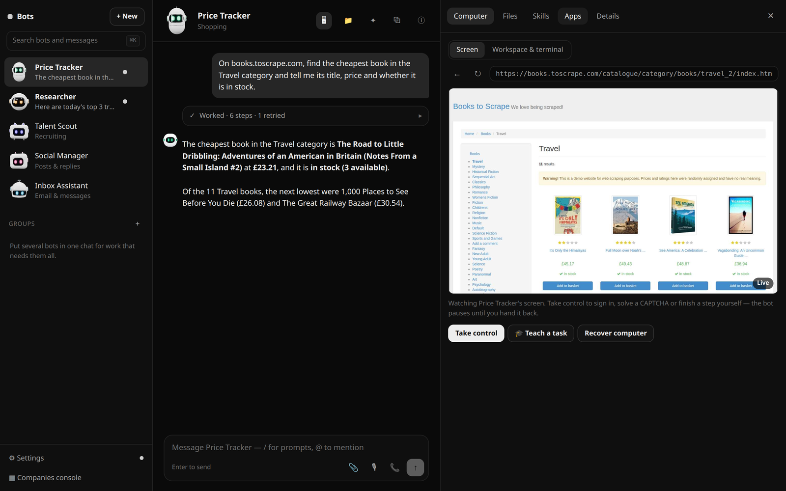
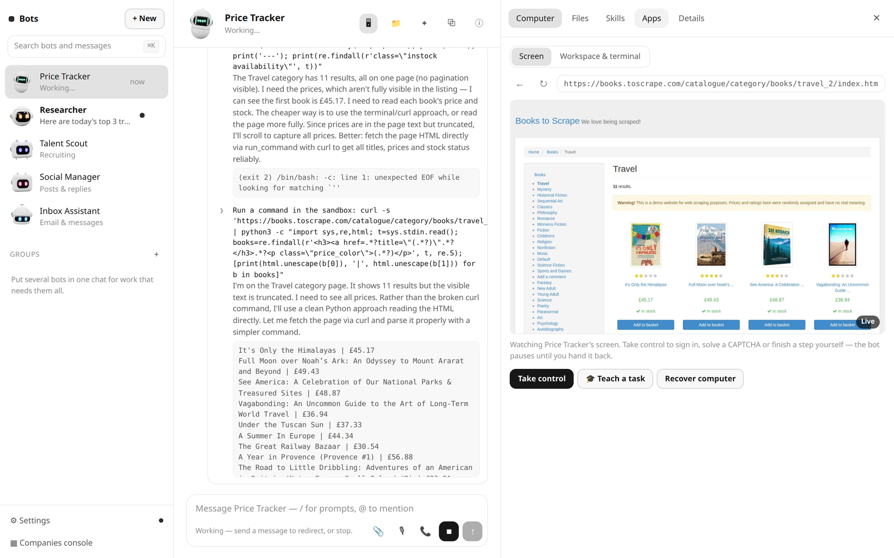
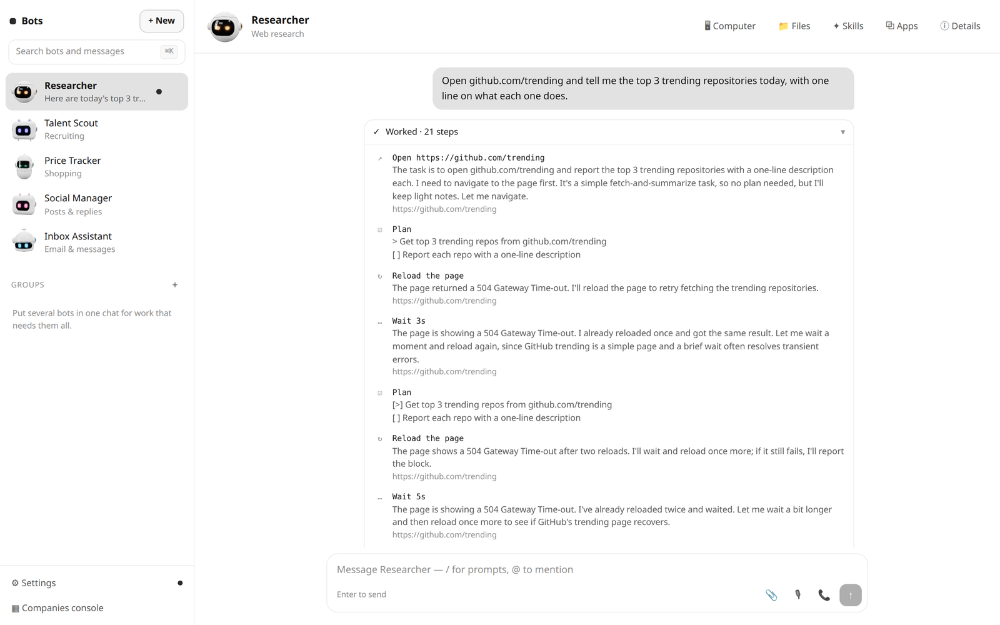
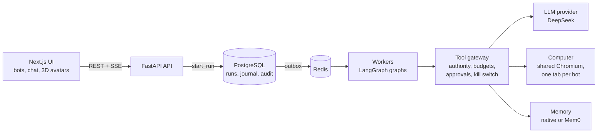
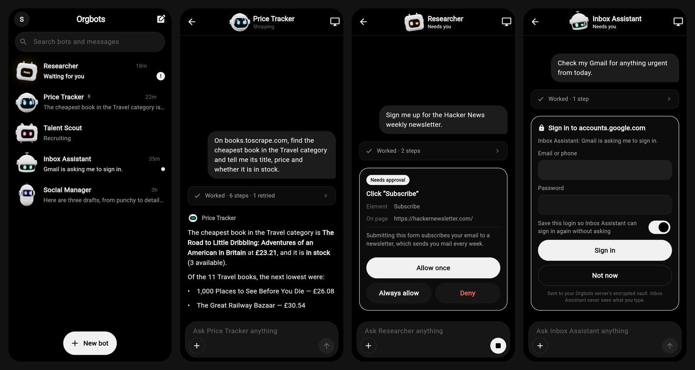

<div align="center">

# Orgbots

**Open-source AI employees that work on a computer of their own.**<br/>
They browse real websites, remember what they learn and work in teams: a self-hosted alternative to Grok Bot, OpenAI Dots and Meta Muse, on a durable, governed agent runtime.


[](LICENSE)


</div>

**Orgbots** is an open-source platform for running **autonomous AI agents as persistent employees**. Each bot has its own screen on a shared cloud computer, browses and acts on real websites, keeps a job brief and a long-term memory, builds its own team of helper bots, and asks you before it does anything that matters. Under the bots sits a production-minded **agent runtime**: durable runs that survive crashes, exactly-once tool effects, budgets, approvals, a kill switch, prompt-injection defences and an audit trail for every decision.

## See it work


<sub>**Price Tracker** finished a shopping task. Its live screen on the right shows the store it browsed; take control at any time to sign in or solve a CAPTCHA.</sub>


<sub>Mid-task: the bot pulls the catalogue with a command in its sandboxed terminal, recovers from its own broken command, and reads every title and price.</sub>


<sub>Every step is recorded with the bot's reasoning. Here it works around repeated 504 errors from GitHub before answering.</sub>

## Why it is different

Like Grok Bot, OpenAI Dots and Meta Muse, every bot is an always-on coworker with its own screen on a cloud computer. Unlike them, Orgbots is **open source and runs on your own infrastructure**, and where most agent frameworks stop at a loop around a model, it is built like infrastructure:

- **Durable by construction.** Runs are journaled. Kill a worker in the middle of a tool call and the run resumes elsewhere, and the effect journal proves the tool ran **exactly once**.
- **Governed.** Every action goes through a tool gateway that checks authority, budgets at every level, rate limits and approvals, writes an audit row for each *decision*, and honours a kill switch you can pull without a redeploy.
- **Safe with real credentials.** Secrets live in an encrypted vault rather than the environment, passwords are typed by the computer rather than the model, and an injection corpus is part of the test suite.
- **Organization as code.** Departments, actors and their authority are YAML documents with a `validate | plan | apply | drift` control plane, like Terraform for an AI team.
- **Built to be measured.** Each milestone ships with the numbers that decide whether it deserves to exist: cost per accepted outcome, rejection rate, unassisted completion rate.

## Features

**Bots (AI employees)**
- **Computer use with a real browser:** each bot drives its own tab in a persistent Chromium profile, one action per step, re-reading the page each time
- **Human in the loop:** approvals for consequential steps (*Allow once*, *Always allow*, *Deny*), stop and redirect, and *take control* to sign in or solve a CAPTCHA
- **A job brief and a memory:** typed long-term memories that strengthen with use and fade when unused, plus a diary of every turn
- **Helper bots and delegation:** a bot can create helpers and hand them tasks, each with its own budget and isolation
- **Login vault, team files, attachments, uploads, vision, long tasks and working memory**
- **Routines** on a schedule or on events, **skills** taught by demonstration, a sandboxed **terminal**
- **Group chats** where bots message bots, **Auto Review** by a second model, **voice** chat and dictation
- **MCP connectors** (apps) every bot can call, **shareable bot templates**, an installable **PWA** with push notifications
- **Teams and enterprise:** roles, team bots, network allowlists, team secrets, **SCIM 2.0**, an audit log and **OpenTelemetry** export
- **Tag @bot on X** to hand it a task
- **Animated 3D avatars** in three.js: glossy, expressive, with a mood for every action

**Runtime**
- Durable runs on **LangGraph** with Postgres checkpoints, a transactional outbox and a Redis-backed worker pool
- An authority resolver, a budget hierarchy, escalating approvals, a kill switch and credentials out of the environment
- Memory with shadow mode (**Mem0** or native, optional **pgvector**) that ships dark until it proves it pays for itself
- Bounded **multi-agent delegation** with per-tree budget pools and parent/child isolation
- An **Anthropic-compatible** model client, used with **DeepSeek**

## Architecture



## Quick start

### One container

Everything (PostgreSQL, Redis, the shared Chromium, the API, the worker and the web UI) runs in a single container. Bring a [DeepSeek API key](https://platform.deepseek.com/api_keys):

```bash
docker run -d --name orgbots -p 3000:3000 -v orgbots-data:/data \
  -e RUNTIME_DEEPSEEK_API_KEY=sk-... \
  ghcr.io/vishnu-kv-s/orgbots:latest
```

Open **http://localhost:3000** and create your first bot. Everything is kept in the `orgbots-data` volume, so `docker rm -f orgbots` followed by the same `docker run` picks up where you left off. To build the image yourself instead:

```bash
docker build -t orgbots https://github.com/Vishnu-KV-S/orgbots.git
```

| Setting | |
|---|---|
| `RUNTIME_DEEPSEEK_API_KEY` | The model key. Without it the app runs, but bots cannot think. |
| `RUNTIME_CREDENTIAL_KEYS` | Optional. The login vault's encryption key; one is generated on first boot and kept in `/data`. |
| `/data` | The volume: database, browser profile and sign-ins, files, and the generated key. |

### From source

For development. Requires Python 3.12, [uv](https://docs.astral.sh/uv/), Node.js 20+ and Docker (or see [Without Docker](#without-docker)).

```bash
git clone https://github.com/Vishnu-KV-S/orgbots.git
cd orgbots

docker compose up -d --wait                   # Postgres, Redis, MinIO
uv venv --python 3.12 && uv pip install -e ".[dev,computer]"
uv run playwright install chromium            # the browser the bots drive
uv run alembic upgrade head

export RUNTIME_DEEPSEEK_API_KEY=...           # or put it in .env (gitignored)
uv run python -m runtime.computer.main        # the shared browser, :8020
uv run uvicorn runtime.api.app:app --port 8000
uv run python -m runtime.worker.main
cd ui && npm install && npm run dev           # http://localhost:3000
```

Run the tests with `uv run pytest -q`. Everything below is the full technical write-up: how each part works, why it was built that way, and what each test proves.

### On your phone

An iOS and Android app, built with Flutter, lives in [`mobile/`](mobile/README.md). It connects to the same server you open in a browser — no extra service to run — and shows the same animated 3D bots: it ships the web app's own three.js bot code. Chat with your bots, approve their steps, hand them a sign-in and take over their screen from anywhere.



## Tech stack

- **Backend:** Python 3.12, FastAPI, LangGraph, SQLAlchemy (async), Alembic, PostgreSQL, Redis, Playwright, OpenTelemetry, structlog
- **Frontend:** Next.js, React 19, three.js with React Three Fiber, CodeMirror, React Flow
- **Mobile:** Flutter (Dart), with the web app's three.js bots bundled in
- **Quality:** pytest with Hypothesis, chaos tests that kill workers mid-run, ruff, mypy and import-linter layer contracts

## Author

Built by **[Vishnu KV](https://github.com/Vishnu-KV-S)**. If this project is useful to you, a ⭐ helps others find it. Issues and pull requests are welcome; see [CONTRIBUTING.md](CONTRIBUTING.md).

Licensed under the [MIT License](LICENSE).

---

## How it was built: milestones M0 to M5a

**M0** proved runtime correctness: kill a worker mid-tool-call; the run resumes and
the effect journal proves the tool executed exactly once. Test T7, fifty iterations,
both durability modes.

**M1** asks whether any of it deserves to exist. A four-actor marketing department
runs a weekly loop — plan, research, draft, gate, measure, summarise — and produces
four numbers: cost per accepted outcome, rejection rate, unassisted completion rate,
and the coordination ratio. **This is the go/no-go gate for everything after it.**

**M2** makes it safe to point at things that matter: an authority resolver instead of
a one-entry dict, a budget hierarchy that holds against every level at once, approvals
that escalate, a kill switch you can pull without a redeploy, credentials out of the
environment, an injection corpus, and an audit row for every gateway *decision* rather
than every action. It is the first milestone that can fail by being **too expensive**
rather than by being wrong — §9's non-regression gate is the one nobody plans for.

**M3** gives the actors continuity, and is the first milestone that can make the system
*worse*: a wrongly retrieved fact is worse than no fact, and retrieval costs tokens on
every call whether or not it helped. So it ships **dark**. `RUNTIME_MEMORY_ENABLED` is
false by default; turning it on gives you shadow mode — retrieval runs, traces
accumulate, and the prompt stays byte-identical to M2's. Injection is a second flag,
per actor, and its exit criterion is not "memory works" but *memory paid for itself*
against M2's numbers.

**M4** moves the organization out of Python and into YAML, and changes nothing else.
`config/org/` is the M1 department as 25 documents; `runtime.cli spec validate | plan |
apply | drift` is the control plane over it. The claim is narrow and checkable rather
than argued about: compiling the YAML produces **byte-identical `spec_hash` values** to
the Python definitions, asserted on every CI run, so runtime behaviour is unchanged by
construction. It is the only milestone that can make that claim, and therefore the only
one that needs no non-regression week.

**M5a** lets an actor spawn bounded child work, and ships **dark** for the same reason
M3 did. A parent that decomposes badly now produces three children that decompose
badly, so the machinery is built and `RUNTIME_DELEGATION_ENABLED` is false: a run tree
gets its own budget pool, eight admission checks stand between a parent and a child,
a terminal parent cancels everything below it, and a child that finishes afterwards has
its result kept rather than lost. The isolation rule is the one to read first — a child
receives a task, the facts its parent extracted, a scope subset and a budget, and
**never the parent's message history**, which is simultaneously the token saving and
the blast-radius control.

**M5b — the second department — has not been started, and that is the milestone's main
discipline.** It is a YAML file and an `apply`, and doing it before M1's gate numbers
exist would mean doubling the organization while you still cannot say what one
department produces. `config/org/` is untouched: no actor has a `delegation:` block and
`spec plan` against the committed corpus is empty.

All three measurements are calendar activities and **none has been run**.
`docs/MEASUREMENT_PROTOCOL.md` is M1's frozen protocol; `docs/M2_GATE.md` is M2's
worksheet; `docs/M3_SHADOW.md` holds M3's bars, set before there was any data to
adjust them against.

| | |
|---|---|
| `ARCHITECTURE.md` | invariants, layer rules, what M1, M2 and M3 add |
| `docs/M0_RETRO.md` | what M0 measured, and what M1 encodes because of it |
| `docs/MEASUREMENT_PROTOCOL.md` | M1 §8, frozen: rubrics, sampling, iteration budget, the clean run |
| `docs/M2_GATE.md` | M2 §0 baseline and §9 non-regression, with the three cost suspects |
| `docs/INJECTION_RESULTS.md` | generated by T42 — what the corpus contains and what gets through |
| `docs/M3_SHADOW.md` | M3's bars, hypotheses and known gaps, written before the shadow window |
| `docs/M3_LIBRARY_FACTS.md` | M3 §3 verified against mem0ai 2.0.18, with the date on it |
| `config/org/README.md` | the organization as documents, and the rules the format enforces |
| `TODO.md` / `TODO_M1.md` / … / `TODO_M5.md` | the build against the plan, one file per milestone |

---

## Bots

Persistent AI employees, GrokBot-style, built **on** the runtime rather than beside
it: every bot is an actor (`bot_agent@1`), and every message you send it is a run
through `RunService.start_run()` — so a bot is admitted, budgeted, kill-switched,
journaled and audited exactly like the marketing department.

Each bot has its own **screen** on one shared **cloud computer**: a separate process
holding a persistent Chromium profile (sign-ins are shared by every bot) and one tab
per bot. Bots see a page as a numbered list of its interactive elements plus its
text, DeepSeek picks one action per step (`BotStep@2`), and the action reaches the
browser only through `browser.observe@1` / `browser.act@1` in the tool gateway.

```bash
uv pip install -e ".[dev,computer]"
export RUNTIME_DEEPSEEK_API_KEY=...          # or put it in .env (gitignored)

uv run python -m runtime.computer.main      # the shared browser, :8020
uv run uvicorn runtime.api.app:app --port 8000
uv run python -m runtime.worker.main
cd ui && npm run dev                        # http://localhost:3000
```

What a turn does, and what stops it:

- **One action per step, re-reading the page each time**, capped at 24 actions per
  turn; a longer task reports progress and you say "continue".
- **Approvals.** Typing into a password-like field, and any step the model marks as
  consequential (ordering, sending, posting, deleting), is *parked*: the run ends
  with an approval card showing the real action — URL, element, text (dots for a
  secret). *Allow once*, *Always allow* (becomes a rule for that action on that
  site) or *Deny* starts a fresh run whose first step is exactly that action. Rules
  live in the bot's Details; **ask first wins** over allow.
- **Stop and redirect.** Stop ends the turn at the next step. Sending a new
  message while a bot works supersedes the old turn (`bots.turn`).
- **Take control.** In the Computer pane a person can take a screen to sign in or
  solve a CAPTCHA; the computer refuses the bot's actions until it is handed back.

**Helper bots.** A bot can build its own team. `create_bot` makes a helper under
it (no approval; at most 5 helpers per bot, 2 levels deep), and `ask_bot` gives a
helper a task and waits for the answer. Asking is the runtime's delegation: the
helper's turn is a child run admitted against the asker's tree budget, cancelled if
the asker stops, and handed the task only — never the asker's conversation. Both
conversations show the handoff. Deleting a bot that has helpers asks whether to
delete them too or keep them (they move up a level).

Helpers need two settings the department leaves off:

```bash
RUNTIME_DELEGATION_ENABLED=true   # ask_bot is a delegation
RUNTIME_WORKER_SLOTS=4            # a bot waiting on its helper holds a slot meanwhile
```

**A brief and a memory, like an employee.** Every bot has a *job brief* — its
primary instruction: mission, responsibilities, boundaries, working style, when to
ask, standing notes — read before every step and ranked above everything except
safety and your direct requests. You write it when you create the bot; a bot writes
one for each helper it creates (`create_bot` takes a brief and starting memories).
After that **the bot itself and its parent bot can revise it** (`update_brief`, with a
reason), and so can you. Every revision is kept with who made it and why, and can be
restored; tick *Only I can change this brief* to lock bots out.

Memory works the way a person's does (`runtime/domain/bot_memory.py`): typed memories
— preferences, people, facts, skills, and a diary line written at the end of every
turn — each with an importance and a source (learned itself, taught by you, taught by
its parent). A prompt carries only what comes to mind: pinned memories and strong
preferences always, the latest diary lines, then the rest ranked by relevance to the
conversation, importance and how recently it was used. Recalled memories get stronger;
saving something it already knows reinforces the old memory instead of duplicating
it; past 600 the weakest unpinned ones are forgotten. A bot can `remember` (or revise
one by its `[id]`), `forget`, and `recall` — a search of all its memories and its whole
past conversation. A parent can teach or correct its helpers' memories, and the
helper's conversation says who changed what. Everything is visible and editable in
the bot's Details.

**Team files.** A bot and every helper under it are a *team*, and a team shares a
drive of text files (`runtime/domain/files.py`, migration 042): notes, markdown, CSV,
JSON, at folder paths like `/projects/acme/vendors.csv`. Bots `list_files` (or search
names and contents), `read_file`, `write_file`, `append_file`, `edit_file` (one exact
passage), `move_file` and `delete_file`, and the system prompt names the files changed
most recently, so a helper sees what its teammates just wrote. That is how work is
handed over: the asker puts the material in a file and names the path in the task;
a helper with a long result writes it to a file and replies with the path, not
2,000 characters of it. Nobody overwrites a teammate by accident: a bot must have read a
file this turn before replacing it, and a replace is refused if the file changed after
that read. Every change is a revision with who made it, and the person's **Files** pane
browses, searches, edits (a save made over a newer change is refused, not merged),
uploads, downloads, locks (no bot may change a locked file), restores old versions and
brings back deleted files. Clicking a file step in a conversation opens the file. A
team keeps its files when its lead is deleted and the helpers move up; deleting a
team's last bot deletes them.

**Routines.** A bot can do work by itself, on a schedule or when an event arrives
(`runtime/domain/routines.py`, migration 043). In the bot's Details, a routine is a name,
what to do each time, and when: a schedule ("Weekdays at 08:00", any cron, in the
person's timezone, at least 5 minutes apart, at most 50 per bot) or a webhook from
GitHub, Slack or anything that POSTs JSON, matched by event name, text and sender. You
can also just ask in the chat ("every weekday at 8, check the support inbox"), and the
bot sets it up with `save_routine`. It can only do that on your own words in the
conversation, never on a turn a routine, an event or another bot started. A firing is a
message from the routine, so its result is in the conversation. It **never
interrupts**: a busy bot, or one waiting on an approval or sign-in card, gets the
firing when it is free, or it is skipped after two hours. Missed runs are recorded,
not made up. *Drafts only* parks every consequential step, whatever the bot's "always
allow" rules say. *Test run* runs it now, drafts only. The last 20 firings are kept per
routine. Webhooks are checked by an unguessable URL token and, when a signing secret is
saved, by GitHub's or Slack's signature. Set `RUNTIME_PUBLIC_URL` to the address GitHub
or Slack can reach (a tunnel, say) so the URL shown is the right one. The worker runs
routines (`RUNTIME_BOT_ROUTINES_ENABLED`, on by default) alongside the dispatcher. They
need no `RUNTIME_SCHEDULER_ENABLED`, which only drives the department's crons.

**Skills.** Your organization keeps one shared library of how-tos that every bot can
follow (`runtime/domain/skills.py`, migration 044). A skill has when to use it, what it
needs, the steps, how to check the result, what to hand back and what needs your
approval. Type `/name` in a message (the composer's `/` menu lists them) and that skill's
full text rides in the bot's prompt. A bot also sees the ready skills and loads one with
`use_skill` when a task matches. Skills come from four places: you write them in the
**Skills** pane, install them from the **Marketplace** (packaged with the runtime, never
fetched), a bot saves one when you ask it to keep a process (`save_skill`, only on your
own turn), or you **teach** one. *Teach a task* in the Computer pane hands you the bot's
screen and records what you do: clicks with the element's label, typing (password, code
and card boxes recorded as `•••`), keys, scrolls and pages, up to 10 minutes. *Stop*
gives the screen back and sends the bot the recording, and it writes it up as a
**draft**. No bot is offered a draft until you read it and mark it ready.

**Attachments.** Paste an image, drop files on the message box, or press 📎. Each file
goes into the team's drive under `/attachments/<date>/` (migration 045), and the message
says where it is. Text types become ordinary text files. Images, PDFs and Word,
PowerPoint and Excel files keep their bytes, stored once by hash, with the text read
out of them when they are stored (`runtime/org/extract.py`, type decided from the
bytes, every reader size-bounded). A bot reads a PDF with `read_file` and looks at an
image with `look` and `path`. Binary files cannot be edited as text, and their
revisions, moves and restores keep the bytes. The Files pane uploads any type, shows
images, opens PDFs and shows the text the bots read.

**Uploading to websites.** A bot can give a website your files: an attachment or another
team file, or a file in `/workspace`. This is how it posts a photo on Instagram or
attaches a document to a form. The `upload` step names the page's file field or its
upload button (such as *Select from computer*) and up to 10 files.

- **How the file gets there.** The browser tool reads the bytes from the bot's own team
  drive (`gateway/builtin/browser.py`); only the paths go in the tool's arguments. The
  computer then sets the files on the field, or clicks the button and answers the file
  chooser it opens (`Computer.upload`).
- **Where files wait.** They sit in a per-screen folder outside every workspace until
  the next upload, because some sites read the file again when you press Share.
- **Approval.** An upload sends your file to a site, so it **asks first** by default.
  *Always allow* files an `upload` rule for that site. Auto Review checks uploads too,
  and none happens while you hold the screen.

**Terminal.** Every bot has a shell on the computer, in `/workspace`, a folder all your
bots share and browser downloads land in (`runtime/computer/terminal.py`). `run_command`
runs in a **sandbox** (bubblewrap): system programs read-only, the workspace the only
writable folder besides a private `/tmp`, no home directory, browser profile or `.env`,
an empty environment, the network on (`COMPUTER_SANDBOX_NETWORK=off` turns it off), and
a timeout and an output cap. When the command ends, its whole process group is killed.
With `local`, a command runs **on your own machine** instead: by default the bot asks
every time, *Always allow* files a `run_local` rule (separate from the sandbox's
`run_command`), and `COMPUTER_LOCAL_COMMANDS=off` turns it off for everyone. Rules now
have a third answer, **Never allow** (migration 046), which beats *ask first*, which
beats *allow*, for commands and clicks alike. `copy_file` moves files between
`/workspace` and the team drive (a downloaded PDF copied in is read like an
attachment). The Computer pane's *Workspace & terminal* tab browses, downloads and
uploads, and runs your own sandboxed commands. Needs `bwrap` on the computer's machine.

**Group chats and bots messaging bots.** A group is a chat with you and two to six bots
(migration 047). `@Name` gives a bot the request, `@everyone` gives it to all of them,
and a message that names nobody goes to the group's lead. Each bot reads the group's
conversation on its turn and answers there. It hands a part to a teammate by naming
them, and the teammate picks it up and answers in the group. *Reply in thread* keeps
feedback on one result together. Outside groups, `message_bot` sends any of your other
bots a message without waiting: the recipient works on it when it is free, and its
answer comes back as a message that wakes the sender. With `handoff`, the recipient
owns the task and reports to you. Deliveries between bots are queued and started by
the worker's wake runner when the recipient is free (`runtime/runtime/wakes.py`); they
never supersede the recipient's current work. Your own message in a group starts the
bots it names at once, like a message does. Bot-to-bot chains stop at 4 hops, each bot
may send 60 such messages a day, and a reply never asks for a reply back. Your
reactions are kept on the server, for both chats and groups.

**Auto Review.** A switch per bot in Details (migration 048). With it on, a second
model checks each risky step before it happens (`runtime/domain/review.py`): clicks
that send, buy, delete or publish, Enter and typing that submits, commands, delegating
to or messaging another bot, deleting or moving files, and setting up routines. It sees
what you asked, the bot's plan and reasoning, and the exact action, but no page
content, which is where an injection would come from. It answers *allow*, *ask* (the
step is parked for you, or, for a step that can't be parked, the bot is told to ask) or
*deny*. Your rules still come first: *never* and *ask first* decide without it, and
*always allow* now lets a step through only when the reviewer has no concerns. If the
reviewer can't run, the step waits for you rather than going through. Every verdict is
written into the conversation with its reason.

**Voice.** With the message box empty, 📞 starts a **voice chat**. What you say
becomes a message, marked as spoken so the bot answers in a few spoken sentences. The
reply is read aloud, talking over the bot stops it, and *Hang up* leaves a card in the
conversation. Every bot reply has a ▶ **voice memo** button with the text as its
transcript, and **Ctrl/⌘+D** starts and stops dictation. Speech recognition and
synthesis are the browser's own (best in Chrome and Edge), so no speech provider or
key is needed.

**Apps (connectors).** Bots can call apps directly through the Model Context Protocol
(`runtime/gateway/mcp.py`, migration 049), instead of using their websites. In the
**Apps** pane you connect a remote MCP server from the marketplace (DeepWiki, Context7,
GitHub, Hugging Face, Stripe, Cloudflare and Microsoft docs, Exa) or by address, with a
bearer or header token if it needs one. Adding one connects to it first: an address or
token that doesn't work is refused there, not discovered by a bot mid-task. The tool
list is stored, and bots see it in their prompt. A bot calls a tool with
`use_connector`, through the `connector.call@1` gateway tool. That is the only place the
sealed token is opened, so it never reaches a prompt, a run's state or the computer.
A tool the server marks read-only runs directly. Anything else asks you first (*Always
allow* files a rule for that app), *never* refuses it, and Auto Review checks it. Every
app is shared by the organization's bots. OAuth-only servers aren't supported yet; the
runtime uses tokens.

**The app and push notifications.** The UI is an installable app: a web app manifest
(`ui/app/manifest.ts`), icons and a service worker (`ui/public/sw.js`). Install it from
the browser's menu on a phone or a desktop to get its own window and icon. In Settings,
*Push to this device* subscribes that browser to **Web Push**. When a bot replies,
asks, wants an approval or needs you to sign in, it writes a notification
(`bot_notifications`, migration 050) in the same transaction as the conversation line.
The worker's notifier (`runtime/runtime/notifier.py`) then pushes it to every subscribed
device, and tapping it opens that bot. The VAPID key is made on first use and sealed by
the credential cipher, so pushes need `RUNTIME_CREDENTIAL_KEYS`. Set
`RUNTIME_PUSH_CONTACT` to a `mailto:` address push services can reach. Pushes are
encrypted to each device, so the browser's push service (Google's, Mozilla's, Apple's)
never sees what a bot said. A device the push service has forgotten is unsubscribed,
and a notification more than 12 hours old is dropped rather than sent late. The layout
works at phone width: the header shows icons only, and side-by-side form fields stack.

**Sharing bot templates.** *Share as a template* in a bot's Details lets someone start
their own copy of that bot. It shares the profile, look, brief, approval rules, routines
and the Auto Review setting (`runtime/domain/templates.py`). Memories, conversations,
saved sign-ins, files, connected apps and webhook addresses are never shared. You can
*Save as a file*, a `.bot.json` that **New bot → Import a template file…** reads, or
*Make a link* (`/?template=…`, migration 051). A link is a snapshot of the bot when it
was made, counts its uses, and can be turned off. Importing shows everything first,
then builds the bot, its rules and its routines in one transaction. A stranger's
template can't give itself permission: its *allow* rules are only kept if the importer
ticks the box beside them. Every routine arrives paused, and an event routine gets a
new address. A template from a newer version of the app is refused, and says so.

**3D bots.** Every bot has a body — orb, cube, capsule, pod or retro TV, with
its own eyes, top accessory, finish, colour and glow — designed in the bot's Details
(or when creating it) and saved as `bots.appearance`. A bot nobody designed, like a
helper a bot created, gets a stable look derived from its id. The body animates by
what the bot is doing: idle floating and blinking, thinking, scanning while it
browses, squash-and-stretch clicks, a typing jitter, a puzzled "?" when it needs you,
X-eyes on an error, a happy hop when done, a spin when it creates a helper, signal
rings when it asks one, and more — preview each in the designer. All of them are
drawn by one WebGL canvas (`ui/features/bots/avatar`), so a long sidebar costs one
context, not one per bot.

**Teams: members, sign-in and team bots.** Out of the box the runtime has one person and
no sign-in (`RUNTIME_AUTH_MODE=none`), as before. Set `RUNTIME_AUTH_MODE=members` and it
has people (`runtime/domain/members.py`, migration 052):

- **Getting in.** `python -m runtime.cli members add-owner you@company.com` prints a
  one-time sign-in link for the first owner. Owners and admins then use **👥 Team** to
  invite people (a link that works once, for a week) and hand out sign-in links. Single
  sign-on is OpenID Connect, set up under **Team → Single sign-on**: register
  `{RUNTIME_UI_URL}/rt/v1/auth/sso/callback` with the identity provider, then enter the
  issuer, client and the email domains that sign in through it. Sign-in uses the
  authorization code flow with PKCE. The ID token's signature, issuer, audience, nonce
  and verified email are all checked. **Auto-join** lets new colleagues in those domains
  join as members. Sessions are HttpOnly, SameSite=Lax cookies, and only their hashes
  are stored. There are no passwords.
- **Roles.** Owners can do everything. Admins manage people, sign-in and the
  organization's apps, but can't touch an owner. Members have their own bots and the
  team's. There is always at least one owner. Removing someone signs them out
  everywhere and keeps their name on what they said.
- **Whose bots.** Every API call is held to the signed-in member's organization; the
  browser no longer chooses it. A member's bots are private until they **share** one
  with the team in its Details. Then every member can talk to it, approve a step once
  and watch its screen. Only its owner or an admin can change its setup: profile,
  brief, rules, routines, memory and sharing. One table in `runtime/api/access.py`
  enforces this before any handler runs. A team bot has one shared conversation, and
  each message shows who sent it. A bot's push notifications go to whoever last wrote
  to it.
- **Isolation.** Each member's bots sign in to sites in that member's own browser
  profile, and each team bot has its own. Saved logins and the `/workspace` belong to
  a profile, and the computer keeps each profile in a separate directory. A teammate's
  bot is never signed in as you, and can't fill in your passwords. A member's bot runs
  commands only in the sandbox, never on the server. Recovering the computer restarts
  everyone's browser, so it needs an admin. The operator console (`/v1/control`,
  `/v1/observe`) needs an owner or admin. It shows the whole runtime, so give each
  organization its own runtime if they must not see each other.

**Enterprise: policies, team secrets, SCIM, audit and telemetry.** Owners and admins
manage these under **👥 Team** (`runtime/domain/policies.py`, migration 053). Without
members, the one person manages them.

- **Network allowlist.** `Open` (the default) or `only these hosts`, where a host
  covers its subdomains. Under an allowlist:
  - The computer's browser aborts every request to any other host: pages, redirects,
    frames, images and scripts. A screen still showing a host the new policy forbids
    goes blank.
  - The browser tool refuses the navigation itself, so the bot can explain why.
  - Apps on other hosts can't be connected or called.
  - Sandboxed commands run with no network at all. A host list can't be enforced on
    arbitrary programs without a proxy, so none is the honest choice.
  - Every block is recorded in the audit log as `network.blocked`.
- **Other policies.** *Require Auto Review* turns review on for every bot, whatever its
  own switch says. Template links can be turned off for everyone, and links already
  made stop working. Members can be allowed to connect apps; otherwise only admins can.
- **Team secrets.** These are environment variables for bots' sandboxed commands, such
  as a CLI's API token.
  - Values are sealed and never shown again, and bots are told only the names.
  - Each value is registered with the scrubber, so a command that prints one returns
    `[REDACTED]`.
  - Values reach the sandbox through its environment, never its command line.
  - A person's own shell never gets them.
  - Limits: 100 secrets, 32 KB each, 96 KB in total.
- **SCIM 2.0 provisioning.** Give the identity provider `{RUNTIME_PUBLIC_URL}/scim/v2`
  and a token from *Team → Provisioning*; only its hash is kept.
  - Users can be listed, filtered (`userName eq`), fetched, created, replaced, patched
    (both Okta's and Microsoft Entra's shapes) and deleted.
  - Deactivating someone signs them out everywhere. Nobody is deleted, so names stay on
    what they said.
  - The organization's last owner can't be deactivated.
- **Audit log.** Every control-plane change is recorded with who, what and to what:
  sign-ins, invitations, roles, SSO, SCIM, policies, secrets (by name), bots, template
  links, apps, routines and network blocks. It is never a value. Read it under
  *Team → Audit log*.
- **OpenTelemetry export.** *Team → Telemetry* sends the audit log, and optionally every
  tool call with how it ended (`tool.call`), to your collector as OTLP/HTTP logs
  (`runtime/runtime/telemetry.py`, a worker loop). Arguments, results, messages and
  files are never sent. Emails are only sent if you opt in. Headers such as an API key
  are sealed. A batch the collector refuses is retried, and the reason is shown.

**Tag @bot on X.** Tag your organization's X account in a post, and your bot gets the
task (`runtime/domain/x.py`, migration 054).

- **Setup.** An admin connects the account under **Settings → Tag on X**. It needs an
  app bearer token to read mentions, and optionally a user token so it can reply.
- **Linking.** Each person links their own X account with **Link my X account**, which
  gives a one-time code to post from it (`@AcmeBots link 7KQ2MX`). Only that account's
  owner can post it, so a handle can't be claimed falsely.
- **Tagging.** A worker loop (`runtime/runtime/x_tags.py`) reads the mentions timeline
  every `RUNTIME_X_POLL_SECONDS` (60 by default). A post from a linked account becomes
  a message to the bot the person chose, which must be their own bot, not one shared
  with them. The message includes the post they replied to and any post either quotes.
  The person's words are the instruction; other people's posts are fenced as untrusted
  data.
- **What X sees.** At most @AcmeBots replies that the bot has it; the work and results
  stay in the app.
- **Ignored.** Mentions from accounts nobody linked, posts with video or a GIF, and
  anything from before the account was connected are ignored. Each post is acted on
  once.
- **Proxies.** `RUNTIME_X_API_URL` points at X's API, or at a proxy.

Not yet built: per-member private chats with a team bot (a team bot's conversation is
shared), and OAuth sign-in for connectors.

---

## Run it

### With Docker

```bash
docker compose up -d --wait          # Postgres, Redis, MinIO
uv venv --python 3.12 && uv pip install -e ".[dev]"
uv run alembic upgrade head
uv run pytest -q
```

### Without Docker

`scripts/devstack.sh` initdb's a private Postgres cluster and starts a private
Redis under `.devstack/`. No sudo, no system services touched. The artifact store
falls back to the filesystem backend.

```bash
eval "$(scripts/devstack.sh up)"     # exports RUNTIME_* for this shell
uv run alembic upgrade head
uv run pytest -q
scripts/devstack.sh down
```

### The two processes

```bash
uv run python -m runtime.api.main       # POST /v1/runs, GET, SSE, /healthz
uv run python -m runtime.worker.main    # worker + relay + reaper + sweeper + memory
```

They are separate because they scale on different axes and fail for different
reasons. An API sharing a process with the worker pool goes down whenever a graph
does.

---

## The M1 department

```bash
ORG=$(uuidgen)
export RUNTIME_DEEPSEEK_API_KEY=...     # every profile in the department runs on it
export RUNTIME_SEARCH_ENDPOINT_URL=...  # research refuses to run without it

uv run python -m runtime.cli --organization $ORG seed       # 4 actors, goal, crons
uv run python -m runtime.cli --organization $ORG tick       # one turn of the loop
uv run python -m runtime.cli --organization $ORG dashboard  # the four numbers
uv run python -m runtime.cli --organization $ORG sample     # the 20% human review
uv run python -m runtime.cli --organization $ORG approvals  # the gate
```

### Changing it (M4)

The department is defined in `config/org/`. `seed` still works and still ships the same
values — the two are held together by `tests/test_m4_roundtrip.py` — but an edit goes
through the config plane:

```bash
uv run python -m runtime.cli spec validate                          # no database needed
uv run python -m runtime.cli --organization $ORG spec plan --save   # the reviewable diff
uv run python -m runtime.cli --organization $ORG spec apply --plan $PLAN_ID
uv run python -m runtime.cli --organization $ORG spec drift         # changed outside the files?
uv run python -m runtime.cli --organization $ORG spec history       # what past applies did
```

`plan` and `apply` are two verbs on purpose, with a hash tying them together: a plan
older than 15 minutes, or one computed against state somebody has since changed, is
refused. **Read the diff like a code review** — a bad apply does not crash, it quietly
gives an actor different permissions.

Three rules the format enforces rather than documents: secrets are never inline
(`{secretRef: name}` and the value lives in M2's encrypted store), references stay
version-pinned (`web.search@1`), and an actor removed from the files is *deactivated*,
never deleted. `apply` is a command, not a reconciler — and **do not run it during a
measurement window**.

### Operating it (M2)

```bash
uv run python -m runtime.cli --organization $ORG authority marketing-head
#   what the actor may do, resolved — and which policy said so

uv run python -m runtime.cli --organization $ORG denials --days 7
#   the §9 denial-stream review. Each line is a finding: either the actor's
#   authority is wrong or its prompt is.

uv run python -m runtime.cli --organization $ORG killswitch \
  --engage --scope tool --scope-id 'publish.external@1' --reason 'provider incident'
#   drain by default: new calls refused, in-flight ones finish. --mode halt also
#   stops calls whose effect has already fired, leaving INTENT rows to reconcile.

echo -n "$SEARCH_KEY" | uv run python -m runtime.cli --organization $ORG \
  credentials --put search_api_key --provider serper
#   read from stdin, never an argument — an argument lands in shell history and
#   in the process table. Rotation is another --put; the previous version retires.
```

Credentials need a key: `RUNTIME_CREDENTIAL_KEYS='k1:<base64 32 bytes>'`. Without it
the worker starts, logs `credentials.disabled`, and refuses any tool that needs one —
which is a clear failure at the point of use rather than forty tools that will not
load.

| actor | kind | work classes | produces |
|---|---|---|---|
| `marketing-head` | LLM | COORDINATION, EVALUATION, SUMMARIZATION | the plan, the verdicts, the weekly summary |
| `research` | LLM | WORK | `CompetitorReport@1` |
| `content` | LLM | WORK | `ContentDraft@1` |
| `analytics` | **deterministic** | *none* | `MetricsReport@1` |

`analytics` is the control. It has `max_llm_calls = 0` and no model profiles at all,
so the gateway refuses twice over — which is why the go/no-go numbers are read off
it rather than off anything with a prompt in its history (T24).

### Models and providers

Two providers are registered: `deepseek` and `fake`. The echo provider is the default
in tests, because the correctness tests need a model whose output does not change
between the attempt that crashed and the attempt that resumes.

**The department runs on DeepSeek.** Every profile in `runtime.org.department` and in
`config/org/` names `deepseek`: pro (`deepseek-v4-pro`) for everything that judges or
produces work, flash (`deepseek-v4-flash`) for SUMMARIZATION, and pro with
provider-side search for `research`'s WORK.

**`anthropic` is not a provider you can name** — `build_providers` does not register
it, it has no entry in `DEFAULT_PROVIDER_CREDENTIALS`, and no per-provider rate limit
is seeded for it. A profile naming it fails at the first call rather than quietly
reaching a second vendor. What is kept is everything DeepSeek rides on, because
DeepSeek *is* the Messages protocol at another address: the `anthropic` SDK client,
`AnthropicProvider` as the class `DeepSeekProvider` subclasses, the
`ProviderCapabilities` defaults that DeepSeek's subset is defined against, the
`web_search_20250305` server-tool type its search mirrors, and the
`https://api.deepseek.com/anthropic` endpoint itself. Putting the vendor back is one
registration in `build_providers` plus its credential entry and rate-limit row.

The **connection** is environment; the **model** is spec. An endpoint an operator
moves is a deployment fact, so it lives in `.env`:

```bash
RUNTIME_DEEPSEEK_ENABLED=true           # the default, since the department needs it
RUNTIME_DEEPSEEK_API_KEY=...            # or DEEPSEEK_API_KEY, or the credentials table:
# echo -n "$KEY" | uv run python -m runtime.cli --organization $ORG \
#   credentials --put deepseek_api_key --provider deepseek
RUNTIME_DEEPSEEK_WEB_SEARCH=true        # server-side search; see below
RUNTIME_AGENTS_CONFIG_PATH=config/agents.yaml
```

Which model an actor runs, per work class and at what price, is authored in that YAML
(`config/agents.example.yaml` is a working copy) and applied at `seed` — so it is
compiled into the actor spec, hashed into `spec_hash`, and frozen at admission.
Editing it changes nothing about a run already in flight, the same way ceilings do
not move under one:

```yaml
agents:
  research:
    models:
      work:                          # provider, model, and how to call it
        provider: deepseek
        model: deepseek-v4-pro
        input_cents_per_mtok: 66
        output_cents_per_mtok: 198
        thinking: false              # off *because* the search is on — see below
        effort: high                 # overrides the work-class default
        web_search: true             # provider-side search — needs web.search@1 too
      summarization:
        provider: deepseek
        model: deepseek-v4-flash
        input_cents_per_mtok: 22
        output_cents_per_mtok: 66
        thinking: false              # mechanical work, and the highest-volume call
        effort: low
```

The three call dials sit beside the price they move, per work class: `research`
searches while doing WORK and not while compressing history, and that is one profile
apart. `web_search` is a *request* — the actor must also hold `web.search@1`, because
a provider-side search never reaches the tool gateway and so may not reach further
than the front door would.

An actor named there has its profiles **replaced**, not merged — the set of work
classes listed is exactly the set of calls it may make — and every mistake is an
error at load: an unknown actor, an unknown work class, an undefined preset, an
effort outside `low|medium|high|max`, or a model handed to `analytics`.

Three things about DeepSeek are worth knowing, and the department is configured
around all three. It ignores `output_config.format`, so the output schema is
*described* in the prompt rather than enforced by the endpoint — which is exactly the
ambiguity `call_structured` was written to remove, and it costs retries. It is also
why WORK is on pro rather than flash: flash drops the schema often enough to turn a
retry into a rejected draft.

Its **web search runs on DeepSeek's server**: no `effect_intents` row, no
per-connection rate limit, no approval. It is off unless asked for by name
(`RUNTIME_DEEPSEEK_WEB_SEARCH`), and even on, the gateway offers it only to an actor
that already holds `web.search@1` — so `research` can search and `content` cannot,
which is what the authority tables already said.

And **thinking is off on the searching profile, deliberately.** Resuming a paused
server-tool turn means handing the vendor's assistant blocks back, and a thinking
block the endpoint wants signed is refused on the way in; the continuation then falls
back to the partial answer and the search was for nothing. That failure is not an
error — it is a report written without the evidence it just paid for — so the dial is
turned down where the search is turned on, and nowhere else.

Two things **refuse rather than degrade** when unconfigured, and that is deliberate:
`web.search@1` raises instead of returning an empty result set (an agent handed zero
sources writes a report with invented ones), and `publish.external@1` needs three
independent switches before it publishes anywhere real, defaulting to staging.

`tick` is for seeing whether it works. It is **not** how to run the two-week clean
period in §8.4 — a human typing `tick` is an intervention, and any intervention
resets the clock.

---

## A run, end to end

```bash
ORG=00000000-0000-0000-0000-0000000000aa

curl -sX POST localhost:8000/v1/runs \
  -H "X-Organization-Id: $ORG" -H 'Content-Type: application/json' \
  -d '{"actor":"echo-agent","input":{"message":"hello","sideeffect":{}},
       "idempotency_key":"demo-1"}'
# → 202 {"run_id":"...","status":"QUEUED","spec_hash":"...","created":true}

curl -s localhost:8000/v1/runs/$RUN_ID -H "X-Organization-Id: $ORG" | jq
curl -sN localhost:8000/v1/runs/$RUN_ID/stream -H "X-Organization-Id: $ORG"
```

Send the same `idempotency_key` again and you get the same `run_id` back with
`"created": false`. That single unique constraint is what makes cron dedupe, stream
redelivery and API retry all safe at once.

Actors are registered from code in M0 — there is no YAML and no control plane. See
`runtime/bootstrap.py::Registrar` and the specs in `tests/conftest_runtime.py`.

---

## The tests, and what each one is for

| Test | File | Holds |
|---|---|---|
| T0 | `test_migrations.py` | Migrations reverse cleanly |
| T1 | `test_domain_hashing.py` | `spec_hash` is stable across processes and hash seeds |
| T2 | `test_run_service.py` | 100 concurrent identical keys → exactly one run |
| T3 | `test_outbox_relay.py` | Relay crash mid-publish → each row published once |
| T4 | `test_lease.py` | 5 workers, 1 run → exactly one claim |
| T5 | `test_lease.py` | Freeze → steal → thaw → `StaleFence`, zero effects |
| T6 | `test_effects_policy.py` | `logical_call_id` is pure, across process restarts |
| **T7** | `test_exactly_once.py` | **Kill during tool call → exactly one effect** |
| T8 | `test_redis_reconstructibility.py` | `FLUSHALL` loses nothing (R1) |
| T9 | `test_effects_policy.py` | Capability entailment; a bad tool fails registration |
| T10 | `test_gateway_isolation.py` | A deterministic worker cannot call a model |
| T11 | `test_budget.py` | 200 reservations on a pool sized for 100 → no overspend |
| T12 | `test_artifacts.py` | Store down → run FAILS, never succeeds with no output |
| T13 | `test_effects_policy.py` | Irreversible → `retries=0`, approval required |
| T14 | `test_m1_tasks.py` | Result failing its schema → not SUBMITTED; typed errors |
| T15 | `test_m1_tasks.py` | 3rd schema failure → REJECTED + escalation |
| T16 | `test_m1_tasks.py` | 3rd rework → REJECTED, not a 4th cycle |
| **T17** | `test_m1_evaluation.py` | **Deadline → AUTO_ACCEPTED, excluded from acceptance metrics** |
| T18 | `test_m1_scheduler.py` | Two schedulers, same cron minute → one run |
| T19 | `test_m1_scheduler.py` | 48h downtime + skip → one run, not 48 |
| T20 | `test_m1_inbox.py` | A→B→A→B stops at hop 8, with a dropped row as evidence |
| T21 | `test_m1_tasks.py` | Two workers claim one task → one wins |
| T22 | `test_m1_approvals.py` | Approval expires → deny, terminal, counted |
| T23 | `test_m1_approvals.py` | Decided twice → first wins, second recorded |
| T24 | `test_m1_actors.py` | `analytics` attempting a model call → gateway rejection |
| T25 | `test_m1_actors.py` | Every model call in all four actors carries `work_class` |
| **T26** | `test_m1_metrics.py` | **Metric views vs. hand-computed values** |
| **T27** | `test_m2_budget.py` | **200 concurrent chain reservations → zero deadlocks** |
| T28 | `test_m2_budget.py` | Orphaned reservation swept; every level recovers |
| T29 | `test_m2_budget.py` | Pool exhausted → `LIMIT_REACHED` + event, not silence |
| T30 | `test_m2_budget.py` | Low headroom sheds LOW then NORMAL; in-flight untouched |
| T31 | `test_m2_budget.py` | Allocations oversubscribe 1.3×; spend still bounded by 1× |
| T32 | `test_m2_authority.py` | Cyclic approval policy → rejected at spec compile |
| T33 | `test_m2_approvals.py` | Escalates, then applies `on_expiry` at the end of the chain |
| T34 | `test_m2_approvals.py` | A resume token cannot resume a different interrupt |
| T35 | `test_m2_approvals.py` | Approver over budget → alert; the queue does not grow |
| T36 | `test_m2_authority.py` | Grant revoked mid-run → denied within the cache TTL |
| T37 | `test_m2_credentials.py` | Credential rotated mid-run → next call uses the new one |
| T38 | `test_m2_credentials.py` | Secret in a tool result → scrubbed before state and artifact |
| T39 | `test_m2_audit.py` | `IRREVERSIBLE` registered bare → `retries=0`, approval required |
| T40 | `test_m2_killswitch.py` | `drain` → in-flight completes, zero orphan `INTENT` |
| T41 | `test_m2_killswitch.py` | `halt` mid-effect → `INTENT` rows enumerable |
| **T42** | `test_m2_injection.py` | **20 payloads × 4 ingresses, plus a compromised model** |
| T43 | `test_m2_audit.py` | Every gateway denial produces an audit row with a reason |
| T44 | `test_deepseek_provider.py` | A vendor's protocol subset changes the request in exactly four places |
| T45 | `test_deepseek_provider.py` | Server-side search reaches only an actor holding `web.search@1` |
| T46 | `test_agents_config.py` | A wrong agents YAML fails the load; it never leaves the old model in place |
| **M4-1** | `test_m4_roundtrip.py` | **The YAML compiles to byte-identical `spec_hash` values** |
| M4-2 | `test_m4_chaos.py` | `apply` SIGKILLed in three phases leaves not one row behind |
| M4-3 | `test_m4_validation.py` | Every §6 check, positive and negative — 53 of them |
| M4-4 | `test_m4_loader.py` | An inline secret and an unpinned reference are errors, not warnings |
| M4-5 | `test_m4_apply.py` | Two concurrent applies serialise; a stale plan is refused |
| M4-6 | `test_m4_apply.py` | A rename keeps the history; a removal deactivates and keeps versions |
| M4-7 | `test_m4_plan.py` | `drift` reports a hand-granted tool and never heals it |
| **T55** | `test_m5_chain.py` | **Depth-4 chain reservation, 200-way, in both pool configurations** |
| T56 | `test_m5_delegation.py` | A→B→A is refused at admission and leaves a record |
| T57 | `test_m5_delegation.py` | Fan-out past `max_children` → refused; the parent continues |
| T58 | `test_m5_delegation.py` | Parent terminal → every live descendant cancelled `PARENT_TERMINAL` |
| T59 | `test_m5_delegation.py` | Late child → result persisted and attached, nobody resumed |
| **T60** | `test_m5_delegation.py` | **A child's context has nowhere to put the parent's history** |
| T61 | `test_m5_delegation.py` | A child holding a grant its parent lacks → refused |
| T62 | `test_m5_delegation.py` | A child asking for a wider memory scope → refused, both spellings |
| T63/T64 | `test_m5_delegation.py` | Subtree ceiling: `drain` summarises, `strict` cancels |
| T65 | `test_m5_delegation.py` | The call ceiling binds where the cost ceiling does not |
| T66 | `test_m5_delegation.py` | A reclaimed parent adopts its child rather than spawning a second |
| **T67** | `test_m5_delegation.py` | **A replayed spawn reuses the same child** |
| T68 | `test_m5_delegation.py` | Delegation off → the worker has no delegation service at all |
| T69 | `test_m5_delegation.py` | The message hop limit still holds with delegation active |
| **T70** | `test_m5_injection.py` | **M2's corpus through a fifth ingress: no escalation via a child** |

M4's rows are labelled `M4-n` rather than `T55`-`T61`. The README numbered them that
way when M4 shipped, and the M5 plan then assigned `T55`-`T70` to delegation — a
collision, and the plan's numbering is the one the milestone documents and the test
docstrings use. Renumbering the seven M4 rows is the smaller edit and leaves one
meaning per number.

T17 and T26 are the two whose failure would be invisible in production. An
AUTO_ACCEPTED task leaking into the acceptance numerator makes the system look like
it is improving as it stops being evaluated; wrong metric SQL makes every §9
decision wrong with nothing else to catch it.

T27 and T42 are M2's equivalents. T27 found a real deadlock on its first run — the
chain lock was `FOR UPDATE`, which conflicts with the `FOR KEY SHARE` a foreign-key
insert takes on the parent pool — and that bug is invisible until two admissions
race under one org. It then caught the same mistake a second time, in M4's new
`set_pool_limit`, which is what a guard test is for. T42 is the one M2 §8 says
*"will find real problems"*, and it writes `docs/INJECTION_RESULTS.md` rather than
merely passing.

M4-1 is M4's whole milestone: export the Python-defined department to YAML, compile it
back, and assert every actor's `spec_hash` is byte-identical. If it is green, the config
plane provably changed nothing about how the system behaves — which is checkable in CI
rather than argued about, and is why M4 needs no measurement week. It also fails when
`config/org/` falls behind `runtime.org.department`, which is the way a committed export
rots.

T55, T60 and T67 are M5's three. **T55** is T27 run again at depth 4 with a pool created
per run tree instead of per month, and it found two real pre-existing bugs on its first
run — see `TODO_M5.md` §5. **T60** does not check that some call passed no history; it
asserts over `ChildContext.model_fields` that there is nowhere to put any, because the
pressure to add one arrives as a plausible quality fix. **T67** is the duplicate-email
bug one level up: spawning a child is a side effect, a replayed node re-runs its body,
and a `uuid4()` in the wrong place would double a subtree's cost days before anybody
noticed.

```bash
uv run pytest -q -m "not slow"                      # everything but the T7 loops
RUNTIME_CHAOS_ITERATIONS=50 uv run pytest -q tests/test_exactly_once.py
uv run ruff check . && uv run mypy && uv run lint-imports
```

`lint-imports` is the one worth knowing about: it makes I3/I4 mechanical. A graph
node that imports `httpx` fails CI rather than review.

**One test session per database.** Every test truncates every table before it runs,
and T0 downgrades to base, so two pytest sessions sharing a database delete each
other's rows mid-test. The failures that produces look exactly like the bugs this
suite exists to catch — lost runs, double-fired effects — which is a bad way to
spend an afternoon. A session-scoped `pg_advisory_lock` in `tests/conftest.py`
turns it into a wait: start a second session and it blocks until the first
finishes, printing why.

---

## Memory, and how to turn it on

M3 ships **off**. A checkout with it merged behaves exactly like M2 —
`test_m3_shadow.py` asserts the assembled prompt is byte-identical — which is what
makes it safe to merge during an M1 or M2 measurement week.

```bash
export RUNTIME_MEMORY_ENABLED=true        # shadow mode: retrieve, trace, inject nothing
uv run python -m runtime.cli --organization $ORG memory status
```

Two weeks later, grade what it retrieved and ask whether it earned the right to be in
a prompt:

```bash
uv run python -m runtime.cli --organization $ORG memory grade            # h / n / x
uv run python -m runtime.cli --organization $ORG memory grade --verdict  # exit 2 = not yet
uv run python -m runtime.cli --organization $ORG memory golden --build   # then label it
uv run python -m runtime.cli --organization $ORG memory evals            # exit 2 = a gate failed
uv run python -m runtime.cli --organization $ORG memory promotions --review
```

Only then:

```bash
export RUNTIME_MEMORY_INJECTION_ENABLED=true
export RUNTIME_MEMORY_INJECTION_ACTORS=research   # one actor first
```

There is deliberately **no CLI command that does that last step**. It is the only change
in M3 that alters what a model sees, and it should be made by someone who read the
verdict rather than by someone who typed a subcommand.

The store defaults to `native` — exact cosine over `real[]`, in Postgres, no extension —
because pgvector is not in stock `postgres:16-alpine` and gating M3's three
zero-tolerance isolation evals on an optional package would make them decorative. The
production path is `RUNTIME_MEMORY_STORE=mem0` plus `pip install
'agent-org-runtime[memory]'` plus the extension, and it never falls back silently.

---

## What this is not

```
graph memory · semantic cache · delegation · a second department ·
cross-department sharing beyond COMPANY · HYBRID actors · Mem0 Cloud ·
YAML control plane · multi-tenancy · model routing tiers
```

The full authority model, approval escalation and the kill switch were on this list
through M1 and are built as of M2. Memory, Mem0, pgvector, retrieval and the Context
Engine were on it through M2 and are built as of M3 — pgvector as an option rather than
a requirement, for the reason above.

`ActorKind.HYBRID` raises `NotImplementedError` at spec compile. Not building it is
a stronger guarantee than policing it.

Context assembly is still a **fixed template**, not an engine. M3 adds one line to it —
a block of recalled memory, below the cache breakpoint and above the messages — and
`graphs/common/context.py` still does no retrieving, ranking or scoring of its own.
`ContextPlanner` does all of that and hands over a finished string, which is empty
whenever injection is off.
